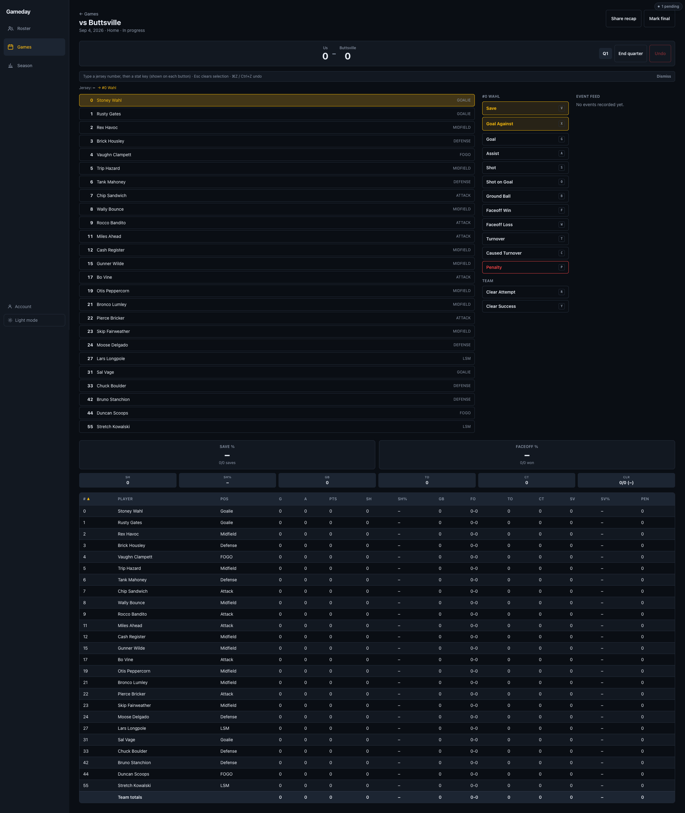

# Gameday Stat Tracker

An offline-first mobile web app for tracking high school lacrosse stats live
during a game. The primary user is a coach standing on the sideline with a
phone, one hand free, often with no reliable wifi or cell signal at the
field — every design decision in this app follows from that constraint.

## Screenshots


_Desktop layout: keyboard-driven three-pane stat entry (player list, stat
buttons with shortcut hints, event feed) with the live box score below._

## Features

- **Roster management** — add, edit, archive players; bulk-paste a roster
  in one flow at the start of the season.
- **Live stat entry** — goals, assists, shots, saves, ground balls,
  faceoffs, turnovers, penalties, and team-level clears, each recorded in
  one tap/click. Undo, a live event feed, and toasts confirm every write.
  The interaction model is deliberately different per device: a two-tap
  jersey-grid flow on phone, a persistent three-pane layout on iPad, and a
  keyboard-driven (jersey number + letter key) flow on desktop.
- **Live box score** — per-player and team totals, computed from the event
  log on every render, with save % and faceoff % called out prominently.
- **Season leaderboard** — every stat, sortable, with column visibility
  toggles and CSV export on wide screens; a per-player detail view shows
  game-by-game splits.
- **Shareable recap graphic** — a canvas-rendered PNG (final score, top
  performers) after a game, downloadable everywhere and shareable via the
  Web Share API on mobile.
- **Installable PWA** — works fully offline from a cold start, including
  app-shell precaching and an offline indicator.
- **Optional cloud sync** — magic-link auth and a background sync engine
  push the local event log to Supabase when configured; the app is fully
  functional with no Supabase project set up at all.

## Tech stack

- [Vite](https://vitejs.dev/) + [React](https://react.dev/) + TypeScript
  (strict mode, no `any`)
- [Tailwind CSS](https://tailwindcss.com/) for styling, with a small set of
  semantic design tokens (see `src/index.css`) driving dark/light theme
- [Dexie.js](https://dexie.org/) over IndexedDB for local storage
- [Supabase](https://supabase.com/) (Postgres + auth) for optional cloud sync
- [vite-plugin-pwa](https://vite-pwa-org.netlify.app/) for the service worker
  and installability
- Deploy target: [Vercel](https://vercel.com/)

Dependencies are kept deliberately lean — CSV export, the recap image, and
the sync outbox are all hand-rolled in well under 100 lines each rather than
pulling in a library.

## Setup

```bash
npm install
npm run dev      # start the dev server (http://localhost:5173)
npm run build    # type-check and build for production
npm run lint     # eslint
npm run format   # prettier --write
```

The app is fully usable at this point — roster, games, live stat entry, box
scores, season stats, and the recap graphic all work with no further setup,
entirely against the local IndexedDB database.

### Optional: cloud sync

Cloud sync is additive, never required. To enable it:

1. Create a [Supabase](https://supabase.com/) project.
2. Run `supabase/migrations/0001_init.sql` against it (SQL editor or
   `supabase db push`), then `supabase/migrations/0002_sync_conflict_resolution.sql`.
3. Copy the project's URL and anon key from **Settings > API** into a local
   `.env` file (copy `.env.example` as a starting point — it's committed,
   `.env` itself is gitignored).
4. In **Auth > URL Configuration**, add whatever origin(s) the app runs on
   (`http://localhost:5173` for dev, your Vercel domain once deployed) to
   the redirect allow-list — magic-link sign-in silently fails to complete
   without this.
5. Sign in from the Account screen (a small link near the theme toggle on
   desktop/iPad, a floating button on phone/iPad-portrait). Recorded stats
   start flushing to Supabase in the background automatically.

## Architecture

### The event log is the source of truth

Every recorded action — a goal, a save, a penalty, a faceoff — is appended
to a single `statEvents` table as an immutable-except-for-soft-delete
record (`src/db/types.ts`). Nothing else is stored: no running score, no
box score totals, no season aggregates. Every one of those is a pure
function computed from the event log at read time (`src/domain/score.ts`,
`quarter.ts`, `boxScore.ts`, `season.ts`), on every render, never cached in
the database.

This one decision is what makes several other things simple:

- **Undo** is just soft-deleting the most recent live event
  (`undoLastEvent` in `src/db/queries.ts`) — there's no separate undo stack
  to keep in sync with the data, because the event log already _is_ the
  undo stack.
- **Sync** is append-only with client-generated UUIDs, so re-syncing the
  same event twice is a no-op by construction, and conflict resolution
  (`supabase/migrations/0002_sync_conflict_resolution.sql`) only has to
  handle two narrow cases (last-write-wins on `players`/`games`, and a
  monotonic OR on `deleted` for `statEvents`) instead of a general
  three-way merge problem.
- **Every screen agrees**, always — the box score, the season leaderboard,
  and the recap graphic can never drift out of sync with each other or with
  what actually happened, because they're all reading the same rows.

The cost is that every derived view recomputes from potentially the whole
event log on every render rather than reading a precomputed value. For a
single team's single season, that's a trivial amount of data — this
tradeoff would need revisiting well before it became a real app at a much
larger scale.

### Local-first data layer

`src/db/` holds the Dexie (IndexedDB) schema and every mutation. All reads
in the UI go through `dexie-react-hooks`' `useLiveQuery`, so any write
anywhere in the app is reflected everywhere it's displayed, live, with no
manual cache invalidation. Every write is synchronous from the user's
perspective — there's no network round-trip on the critical path of
recording a stat, ever.

### Responsive layout, not responsive styling

The app targets four distinct device/use-case combinations (phone, iPad,
laptop/desktop, each with a different interaction model — see
`CLAUDE.md`'s device-class notes), and where the interaction genuinely
differs, it's a separate component switched on breakpoint
(`src/hooks/useBreakpoint.ts`), not one layout stretched with conditional
Tailwind classes. `src/components/stat-entry/` is the clearest example:
`PhoneStatEntryLayout`, `IpadStatEntryLayout`, and `DesktopStatEntryLayout`
share the same recording logic (`StatEntryPanel.tsx`) but are otherwise
independent, down to phone's tap-to-swap grid, iPad's persistent three-pane
layout, and desktop's keyboard-shortcut listener (which only exists while
the desktop layout is mounted, so it can never leak into a touch layout).

### Sync engine

`src/sync/` implements a local outbox: every mutation enqueues a pending
row keyed by `(entityType, entityId)` (`enqueueSync` in `queue.ts`), and
`flushSyncQueue` (`syncEngine.ts`) pushes pending rows to Supabase on
mount, on reconnect, and on a periodic fallback (`useSyncEngine.ts`). A
sync failure is recorded onto the queue item and retried on the next flush
— it never surfaces as an error that interrupts stat entry, per the app's
core offline-first rule.

### PWA and offline hardening

`vite-plugin-pwa` precaches the app shell (JS/CSS/HTML/icons) with a SPA
fallback, so the app boots from cold with no network at all. An offline
indicator (`src/components/layout/OfflineIndicator.tsx`) reflects the
device's actual network interface state, kept deliberately separate from
the sync status indicator, which answers a different question ("is my data
reaching the cloud") — the two can legitimately disagree (online with a
broken Supabase project, or offline with everything already synced).

## Project structure

```
src/
  auth/        Supabase auth (magic link), additive — never gates the app
  components/  UI components, grouped by feature (stat-entry/, box-score/,
               season/, recap/, layout/, roster/, games/)
  db/          Dexie schema, types, and every local mutation
  domain/      Pure derivation logic — no React, no persistence (score,
               box score, season aggregation, recap data/image, etc.)
  hooks/       useBreakpoint, useOnlineStatus, useTeam
  pages/       One component per route
  supabase/    Supabase client (null when unconfigured, never throws)
  sync/        The local outbox and background flush engine
  theme/       Dark/light theme provider
  toast/       App-wide toast notifications
supabase/
  migrations/  Postgres schema + RLS + conflict-resolution triggers
```

See [PROGRESS.md](PROGRESS.md) for the phase-by-phase build history and the
reasoning behind less obvious decisions along the way.
